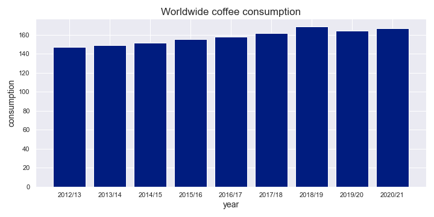

# Project: Ukrainian coffee market segments

### Introduction

Coffee has become an integral part of our everyday lives. We start the day with it, have one with friends/colleagues over a break, and even go on coffee dates. It's not surprising that almost any establishment has a variety available 24/7. Why is it so? 

<figure>
  
    <figcaption><i>Fig.1 - Worldwide coffee consumption 2012-2021.</i></figcaption>
</figure>

The answer is pretty simple - it brings **a lot** of money. To illustrate the impact of coffee on our daily life, let's look at some numbers. In 2020/2021 the total coffee consumption worldwide had been estimated to be 166.63 million 60kg bags [1]. Moreover, within five years, the market is estimated to bring $201.4 billion [2]. It makes sense why coffee stands are popping up on every corner, doesn't it? 

